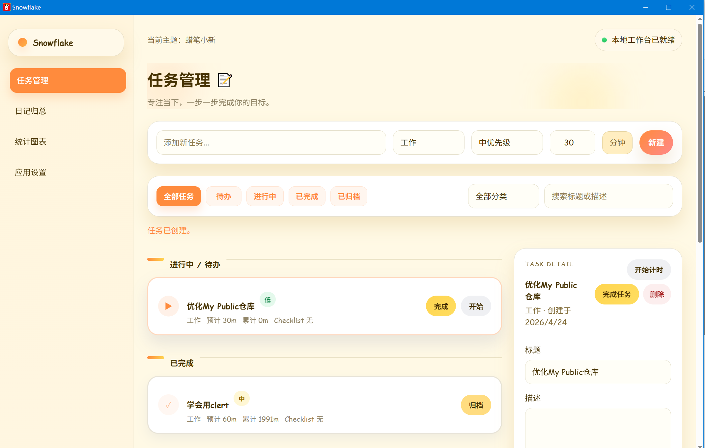
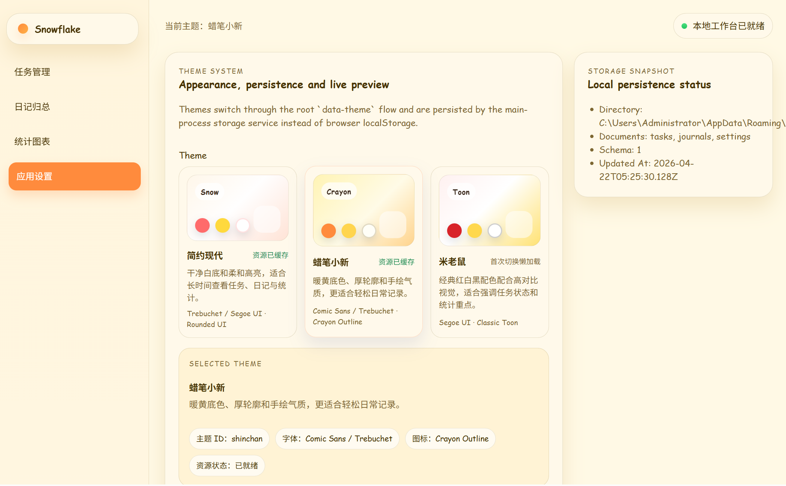

# Snowflake

[](LICENSE)
[](https://www.electronjs.org/)
[](https://react.dev/)
[](https://nodejs.org/)

Snowflake 是一个基于 Electron、React 和 TypeScript 的离线桌面应用，用于个人任务管理、日记总结、时间追踪、统计分析，以及本地数据导入导出。

## UI Preview

### Home



### App Config



## Development

```bash
npm install
npm run dev
```

## Quality Checks

```bash
npm run typecheck
npm run test
```

当前自动化测试覆盖：
- 主进程存储、任务、日记、统计、导入导出服务
- 主进程 IPC/runtime 与窗口创建
- `preload` IPC 契约
- 渲染层 `App/Settings` 集成测试
- 主题系统逻辑测试

## Production Build

```bash
npm run build
```

构建产物输出到 `out/`。

## Windows Packaging

```bash
npm run pack:win
npm run dist:win
```

- `pack:win` 产出未安装目录版本，便于快速验包。
- `dist:win` 产出 NSIS 安装包，默认输出到 `dist/`。
- 当前打包配置会复用本地 `node_modules/electron/dist`，避免构建时重复下载 Electron 二进制。
- 当前产物为未签名安装包，适合本地测试与内部验证。

最近一次验证已成功产出：
- `dist/Snowflake-0.1.0-setup-x64.exe`
- `dist/win-unpacked/`

安装包下载：
- [Snowflake-0.1.0-setup-x64.exe（百度网盘）](https://pan.baidu.com/s/1OTc8szqDVTVA2qopwcxq4g?pwd=1024)
- 提取码：`1024`

## Release Checklist

发布前请执行并记录：
- `npm run typecheck`
- `npm run test`
- `npm run dist:win`
- 按 [RELEASE_CHECKLIST.md](RELEASE_CHECKLIST.md) 完成手动回归

## 贡献

欢迎提交 Issue 和 PR 共同维护项目：

- [Issues](../../issues)
- [Pull Requests](../../pulls)
